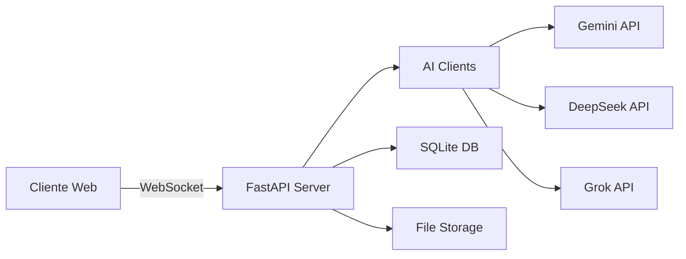

<div align="center">
  
  
  # 🤖 Multi-AI Chatbot
  
  <p align="center">
    <strong>Uma interface elegante e poderosa para conversar com múltiplas IAs em tempo real</strong>
  </p>
  
  <p align="center">
    
    
    
    
    
  </p>

  <p align="center">
    <a href="#-features">Features</a> •
    <a href="#-demo">Demo</a> •
    <a href="#-instalação">Instalação</a> •
    <a href="#-uso">Uso</a> •
    <a href="#-tecnologias">Tecnologias</a> •
    <a href="#-contribuindo">Contribuindo</a>
  </p>

  
</div>

## ✨ Features

<table>
  <tr>
    <td>
      <h3>🌟 Múltiplas IAs</h3>
      <ul>
        <li>✅ Gemini 2.5 Pro</li>
        <li>✅ DeepSeek Reasoner</li>
        <li>✅ Grok 3 Mini</li>
        <li>✅ Troca instantânea entre modelos</li>
      </ul>
    </td>
    <td>
      <h3>💬 Chat Avançado</h3>
      <ul>
        <li>✅ Streaming em tempo real</li>
        <li>✅ Histórico completo</li>
        <li>✅ Syntax highlighting</li>
        <li>✅ Renderização Markdown</li>
      </ul>
    </td>
  </tr>
  <tr>
    <td>
      <h3>🎨 Interface Moderna</h3>
      <ul>
        <li>✅ Tema Dark/Light</li>
        <li>✅ Glassmorphism design</li>
        <li>✅ Animações suaves</li>
        <li>✅ Totalmente responsivo</li>
      </ul>
    </td>
    <td>
      <h3>🔧 Funcionalidades</h3>
      <ul>
        <li>✅ Sistema de tags</li>
        <li>✅ Favoritos</li>
        <li>✅ Templates de prompts</li>
        <li>✅ Exportação de dados</li>
      </ul>
    </td>
  </tr>
</table>

## 🎬 Demo

<div align="center">
  
  
  <p><em>Interface principal mostrando uma conversa com múltiplas IAs</em></p>
</div>

### 🎯 Principais Características

- **🚀 Performance**: WebSocket para comunicação em tempo real
- **💾 Persistência**: SQLite para armazenamento local eficiente
- **🔒 Segurança**: Escape automático de HTML e sanitização de inputs
- **📊 Analytics**: Estatísticas detalhadas de uso e gráficos interativos
- **🎨 Customização**: Temas, partículas animadas e preferências personalizáveis

## 🛠️ Instalação

### Pré-requisitos

- Python 3.8 ou superior
- pip (gerenciador de pacotes Python)
- API Keys das IAs (veja [Configuração](#configuração))

### 1️⃣ Clone o repositório

```bash
git clone https://github.com/seu-usuario/multi-ai-chatbot.git
cd multi-ai-chatbot
```

### 2️⃣ Crie um ambiente virtual

```bash
# Linux/macOS
python -m venv venv
source venv/bin/activate

# Windows
python -m venv venv
venv\Scripts\activate
```

### 3️⃣ Instale as dependências

```bash
pip install -r requirements.txt
```

### 4️⃣ Configure as variáveis de ambiente

Crie um arquivo `.env` na raiz do projeto:

```env
# API Keys
GEMINI_API_KEY=sua_chave_gemini_aqui
DEEPSEEK-API=sua_chave_deepseek_aqui
GROK-API=sua_chave_grok_aqui

# Configurações opcionais
PORT=8000
HOST=0.0.0.0
DEBUG=False
```

### 5️⃣ Execute o servidor

```bash
python app.py
```

O servidor estará disponível em `http://localhost:8000` 🎉

## 📖 Uso

### Interface Principal

1. **Nova Conversa**: Clique em "Nova Conversa" para iniciar
2. **Trocar Modelo**: Use os botões no header para alternar entre IAs
3. **Enviar Mensagem**: Digite e pressione Enter (Shift+Enter para nova linha)
4. **Gerenciar Sessões**: Use a sidebar para navegar entre conversas

### Atalhos de Teclado

| Atalho | Ação |
|--------|------|
| `Enter` | Enviar mensagem |
| `Shift + Enter` | Nova linha |
| `Ctrl + /` | Toggle sidebar |
| `Ctrl + K` | Busca global |
| `Ctrl + D` | Toggle tema |

### Templates de Prompts

```javascript
// Exemplo de template
{
  "name": "Análise de Código",
  "prompt": "Analise o seguinte código e sugira melhorias...",
  "category": "coding"
}
```

## 🏗️ Arquitetura

```
multi-ai-chatbot/
│
├── app.py              # Servidor FastAPI principal
├── requirements.txt    # Dependências Python
├── .env               # Variáveis de ambiente (não commitado)
│
├── templates/
│   └── index.html     # Interface SPA completa
│
├── static/            # Arquivos estáticos (se necessário)
├── uploads/           # Arquivos enviados pelos usuários
└── exports/           # Exportações de sessões
```

### 🔄 Fluxo de Dados



## 🚀 Tecnologias

### Backend
- **[FastAPI](https://fastapi.tiangolo.com/)** - Framework web moderno e rápido
- **[SQLite](https://www.sqlite.org/)** - Banco de dados embutido
- **[WebSockets](https://websockets.readthedocs.io/)** - Comunicação em tempo real
- **[aiohttp](https://docs.aiohttp.org/)** - Cliente HTTP assíncrono
- **[Google Generative AI](https://ai.google.dev/)** - SDK do Gemini

### Frontend
- **[Alpine.js](https://alpinejs.dev/)** - Framework JavaScript reativo
- **[Tailwind CSS](https://tailwindcss.com/)** - Framework CSS utilitário
- **[Prism.js](https://prismjs.com/)** - Syntax highlighting
- **[Chart.js](https://www.chartjs.org/)** - Gráficos interativos
- **[Marked.js](https://marked.js.org/)** - Parser Markdown
- **[SweetAlert2](https://sweetalert2.github.io/)** - Alertas bonitos
- **[Particles.js](https://vincentgarreau.com/particles.js/)** - Efeitos de partículas

## 📊 API Endpoints

### Sessions
```http
GET    /api/sessions          # Listar sessões
POST   /api/sessions          # Criar sessão
GET    /api/sessions/{id}     # Obter sessão
PUT    /api/sessions/{id}     # Atualizar sessão
DELETE /api/sessions/{id}     # Deletar sessão
```

### Messages
```http
GET    /api/search            # Buscar mensagens
POST   /api/favorites         # Adicionar favorito
GET    /api/favorites         # Listar favoritos
```

### Templates
```http
GET    /api/templates         # Listar templates
POST   /api/templates         # Criar template
POST   /api/templates/{id}/use # Usar template
```

### WebSocket
```javascript
ws://localhost:8000/ws

// Mensagens
{
  "type": "message",
  "sessionId": "uuid",
  "message": "texto",
  "model": "Gemini 2.5 Pro"
}
```

## 🔧 Configuração Avançada

### Adicionar Novo Modelo de IA

1. Adicione o enum em `app.py`:
```python
class AIModel(Enum):
    GEMINI = "Gemini 2.5 Pro"
    DEEPSEEK = "DeepSeek Reasoner"
    GROK = "Grok 3 Mini"
    SEU_MODELO = "Seu Modelo"  # Novo!
```

2. Crie o cliente:
```python
class SeuModeloClient(AIClient):
    async def send_message_stream(self, message: str, history: List[Dict[str, str]] = None):
        # Implementação aqui
        pass
```

3. Registre o cliente:
```python
clients = {
    AIModel.GEMINI: GeminiClient(),
    AIModel.DEEPSEEK: DeepSeekClient(),
    AIModel.GROK: GrokClient(),
    AIModel.SEU_MODELO: SeuModeloClient()  # Novo!
}
```

### Personalização da Interface

Edite as variáveis CSS em `index.html`:
```css
:root {
    --bg-primary: #0f0f0f;
    --accent-blue: #3b82f6;
    /* Adicione suas cores */
}
```

## 🤝 Contribuindo

Contribuições são sempre bem-vindas! 

1. Fork o projeto
2. Crie sua feature branch (`git checkout -b feature/AmazingFeature`)
3. Commit suas mudanças (`git commit -m 'Add some AmazingFeature'`)
4. Push para a branch (`git push origin feature/AmazingFeature`)
5. Abra um Pull Request

### 📋 Checklist para PRs

- [ ] Código segue o estilo do projeto
- [ ] Testes foram adicionados/atualizados
- [ ] Documentação foi atualizada
- [ ] Sem conflitos com a branch principal

## 📄 Licença

Este projeto está sob a licença MIT. Veja o arquivo [LICENSE](LICENSE) para mais detalhes.

## 🙏 Agradecimentos

- [Anthropic](https://www.anthropic.com/) pela inspiração no design
- [OpenAI](https://openai.com/) pelos padrões de API
- [Google](https://ai.google/) pelo Gemini API
- Comunidade open source pelos componentes utilizados

## 📞 Contato

<div align="center">
  
  [](https://github.com/seu-usuario)
  [](https://linkedin.com/in/seu-usuario)
  [](mailto:seu-email@gmail.com)
  
  <p>Feito com ❤️ e ☕ por [Seu Nome]</p>
  
  
</div>
